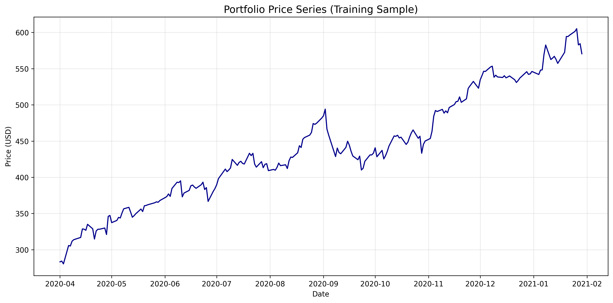
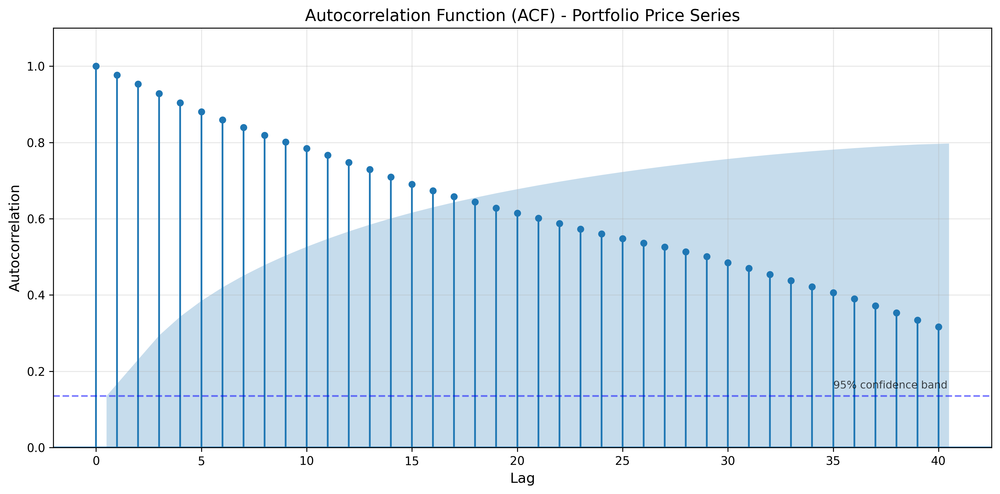
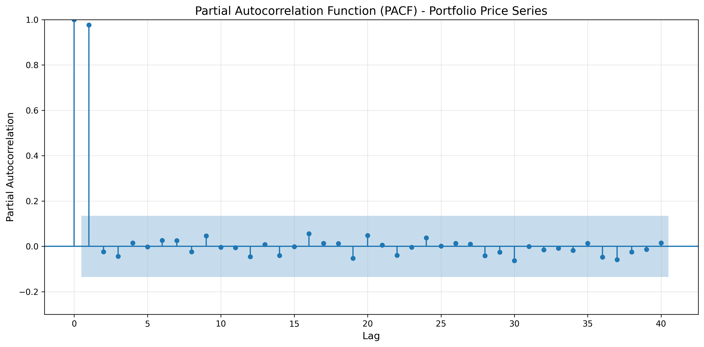
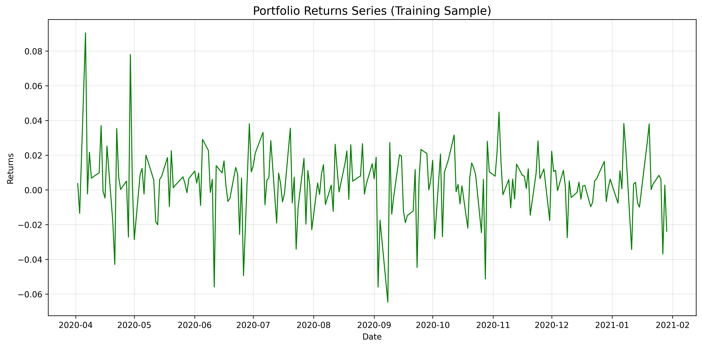
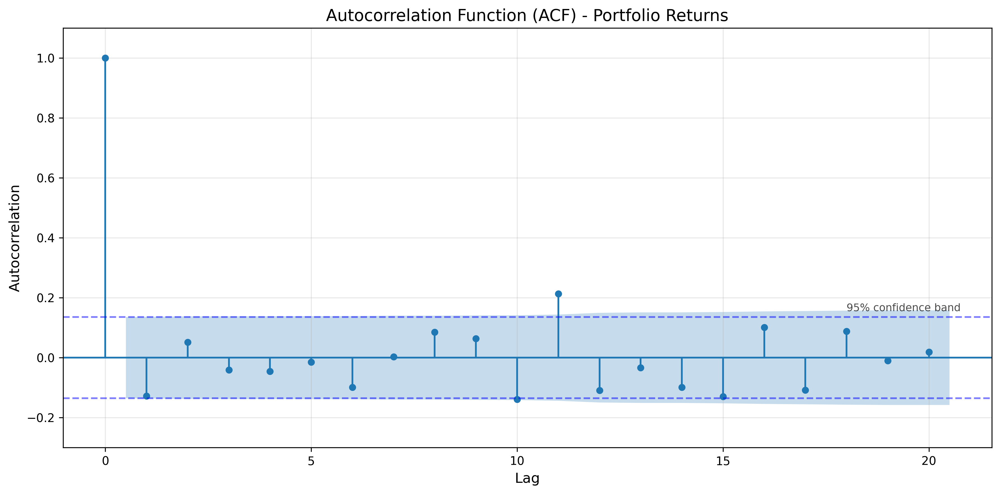
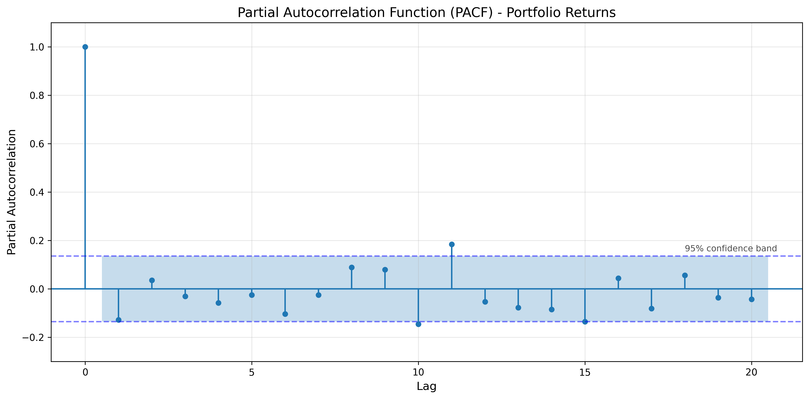
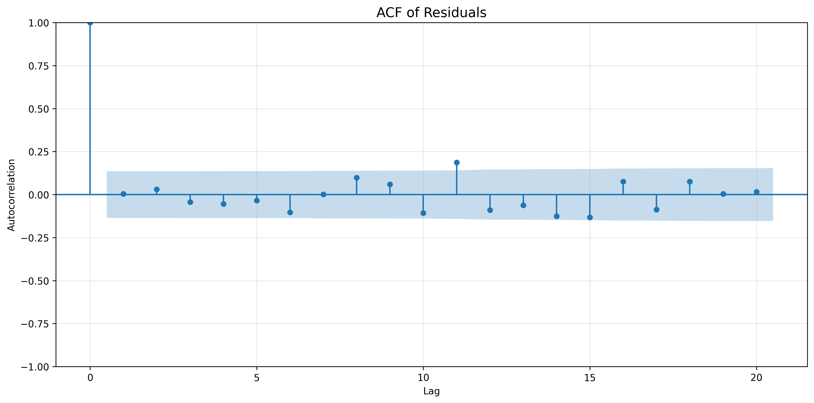
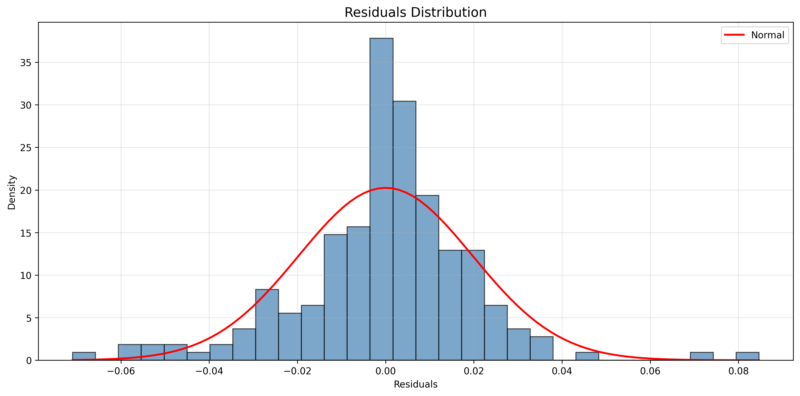
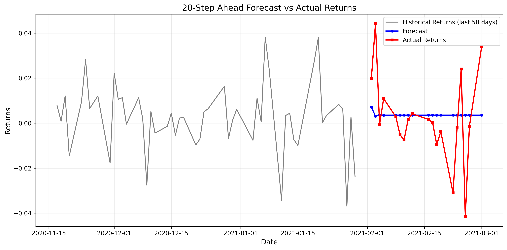

# Econometrics Project: Portfolio Return Modeling

This document presents **Part 1: Portfolio Return Modeling**. The analysis includes price series examination, returns calculation, ARIMA modeling, and forecasting.

## Data Overview

- **Total observations:** 230
- **Training sample:** 210 observations (first 210)
- **Test sample:** 20 observations (last 20, reserved for forecasting)
- **Time period:** 2020-04-01 to 2021-03-01

**Portfolio composition:**

- 25% Apple (AAPL)
- 15% Tesla (TSLA)
- 20% Yandex (YNDX)
- 20% Google (GOOGL)
- 20% Boeing (BA)

---

### 1.1 Time Series Plot

**Observations:**

- **Trend:** The portfolio price shows a strong upward trend from $280.44 (April 2020) to $605.13 (February 2021), more than doubling in value.
- **Seasonality:** No clear seasonal pattern is visible at the daily frequency.
- **Volatility:** The series shows periods of rapid growth followed by declines.

### 1.2 Autocorrelation Function (ACF) and Partial Autocorrelation Function (PACF)

**ACF values (first 5 lags):**

| Lag | ACF |
|-----|-----|
| 1 | 0.9769 |
| 2 | 0.9532 |
| 3 | 0.9280 |
| 4 | 0.9041 |
| 5 | 0.8807 |

**PACF values (first 5 lags):**

| Lag | PACF |
|-----|------|
| 1 | 0.9815 |
| 2 | -0.0294 |
| 3 | -0.0551 |
| 4 | 0.0208 |
| 5 | -0.0023 |

**ACF Plot:**

**PACF Plot:**

**Interpretation:**

- The ACF values remain high across all five lags (from 0.9769 to 0.8807), meaning that past prices are strongly correlated with current prices even after several days.
- The PACF shows a strong value of 0.9815 at lag 1, followed by values close to zero (-0.0294, -0.0551, 0.0208, -0.0023) at lags 2 through 5. This means that after accounting for yesterday's price, earlier days have almost no additional influence.

### 1.3 Augmented Dickey-Fuller (ADF) Test

| Statistic | Value |
|-----------|-------|
| ADF Statistic | -0.3491 |
| p-value | 0.9183 |
| Critical Value (1%) | -3.4645 |
| Critical Value (5%) | -2.8766 |
| Critical Value (10%) | -2.5748 |
| Number of lags used | 15 |
| Number of observations | 194 |

**Conclusion:**

The ADF test statistic (-0.3491) is greater than all critical values, and the p-value (0.9183) is well above the 0.05 significance level. Therefore, we **fail to reject the null hypothesis** of a unit root. This confirms that the price series is **non-stationary**, meaning it does not have a constant mean or variance over time.

---

## Stage 2. Analysis of Returns Series

### 2.1 Returns Time Series Plot

**Observations:**

- Unlike the price series, returns fluctuate around zero and do not show a clear upward or downward trend.
- Periods of large movements are followed by periods of smaller movements.
- The returns range from about -6.5% to 9.0%.
### 2.2 Summary Statistics

| Statistic | Value |
|-----------|-------|
| Mean Return | 0.003552 (0.3552%) |
| Standard Deviation | 0.019867 (1.9867%) |
| Minimum | -0.064669 (-6.4669%) |
| Maximum | 0.090425 (9.0425%) |

The average daily return of 0.3552% reflects the strong upward trend observed in the price series.

### 2.3 Autocorrelation Function (ACF) and Partial Autocorrelation Function (PACF) for Returns

**ACF values (first 5 lags):**

| Lag | ACF |
|-----|-----|
| 1 | -0.1280 |
| 2 | 0.0511 |
| 3 | -0.0412 |
| 4 | -0.0457 |
| 5 | -0.0153 |

**PACF values (first 5 lags):**

| Lag | PACF |
|-----|------|
| 1 | -0.1286 |
| 2 | 0.0357 |
| 3 | -0.0314 |
| 4 | -0.0586 |
| 5 | -0.0262 |

**Note:** With 209 observations, the 95% confidence band is approximately **±0.136**. Values within this range are not statistically significant.

**ACF Plot:**

**PACF Plot:**

**Interpretation:**

- The ACF at lag 1 is -0.1280, which is within the 95% confidence band (±0.136). This means the correlation between today's return and yesterday's return is not statistically significant.
- All other lags also have values close to zero and remain within the confidence band.
- The PACF shows a similar pattern: a small negative value at lag 1 and no significant spikes afterward.
- This pattern indicates that returns have **no significant autocorrelation**, meaning past returns do not help predict future returns.

### 2.4 Augmented Dickey-Fuller (ADF) Test for Returns

| Statistic | Value |
|-----------|-------|
| ADF Statistic | -16.2673 |
| p-value | 0.0000 |
| Critical Value (1%) | -3.4622 |
| Critical Value (5%) | -2.8755 |
| Critical Value (10%) | -2.5742 |
| Number of lags used | 0 |
| Number of observations | 208 |

**Conclusion:**

The ADF test statistic (-16.2673) is far less than the critical value at the 1% level, and the p-value (0.0000) is effectively zero. Therefore, we **reject the null hypothesis** of a unit root. The returns series is **stationary**, which satisfies a key requirement for ARIMA modeling.

---

## Stage 3. ARIMA Modeling

### 3.1 Model Selection

Based on the ACF/PACF patterns of returns, the following models were estimated:

| Model | AIC |
|-------|-----|
| ARIMA(1,0,0) | -1043.37 |
| ARIMA(0,0,1) | -1043.12 |
| ARIMA(0,0,0) | -1041.90 |
| ARIMA(1,0,1) | -1041.66 |

**Selected model:** ARIMA(1,0,0) with AIC = -1043.37

The AR(1) specification provides the best fit according to the Akaike Information Criterion.

### 3.2 Model Coefficients

| Coefficient | Estimate | Std Error | z-statistic | p-value |
|-------------|----------|-----------|-------------|---------|
| const | 0.003562 | 0.001234 | 2.8868 | 0.0039*** |
| ar.L1 | -0.129162 | 0.074556 | -1.7324 | 0.0832* |
| sigma2 | 0.000386 | 0.000025 | 15.6068 | 0.0000*** |

*Significance codes: *** p<0.01, ** p<0.05, * p<0.1*

**Interpretation:**

- The constant term is 0.0036 (p = 0.0039), indicating a statistically significant average daily return of 0.3562%.
- The AR(1) coefficient is -0.1292 with p-value = 0.0832. This coefficient is marginally significant at the 10% level but not at the conventional 5% level, suggesting weak negative autocorrelation in daily returns.

### 3.3 Residual Diagnostics

**ACF of Residuals:**

**Residuals Density Plot:**

**Ljung-Box Test:**

| Lags | LB Statistic | p-value |
|------|--------------|---------|
| 5 | 1.5074 | 0.9122 |
| 10 | 9.3451 | 0.4997 |
| 15 | 27.3600 | 0.0259 * |
**Interpretation:**

- The ACF plot shows no significant autocorrelation in residuals at the first 10 lags.
- The density plot shows that residuals have heavier tails compared to a normal distribution. This means extreme values occur more often than would be expected under a normal distribution.
- The Ljung-Box test shows no significant autocorrelation at lags 5 and 10 (p > 0.05), but indicates some remaining autocorrelation at lag 15 (p = 0.0259). This may reflect patterns in volatility rather than in the returns themselves.

**Overall Assessment:**

The ARIMA(1,0,0) model provides a reasonable description of the return dynamics. The AR(1) coefficient of -0.1292 suggests weak negative correlation, but it is not strong enough to be statistically significant at the 5% level. The model can be used for forecasting, though we should expect limited accuracy.

---

## Stage 4. Forecasting Results

### 4.1 20-Step Ahead Forecast

**First 10 Forecasted vs Actual Returns:**

| Date | Forecast | Actual |
|------|----------|--------|
| 2021-02-02 | 0.007096 (0.7096%) | 0.019977 (1.9977%) |
| 2021-02-03 | 0.003106 (0.3106%) | 0.044135 (4.4135%) |
| 2021-02-04 | 0.003621 (0.3621%) | -0.000597 (-0.0597%) |
| 2021-02-05 | 0.003555 (0.3555%) | 0.010900 (1.0900%) |
| 2021-02-08 | 0.003563 (0.3563%) | 0.002799 (0.2799%) |
| 2021-02-09 | 0.003562 (0.3562%) | -0.005136 (-0.5136%) |
| 2021-02-10 | 0.003562 (0.3562%) | -0.007462 (-0.7462%) |
| 2021-02-11 | 0.003562 (0.3562%) | 0.001674 (0.1674%) |
| 2021-02-12 | 0.003562 (0.3562%) | 0.004148 (0.4148%) |
| 2021-02-16 | 0.003562 (0.3562%) | 0.001665 (0.1665%) |

### 4.2 Forecast Accuracy

| Metric | ARIMA(1,0,0) | Naive (Zero) |
|--------|--------------|--------------|
| MAE (Mean Absolute Error) | 0.013422 (1.3422%) | 0.012936 (1.2936%) |
| RMSE (Root Mean Squared Error) | 0.019185 (1.9185%) | 0.019347 (1.9347%) |

**Interpretation:**

The ARIMA(1,0,0) model achieves a MAE of 0.013422 (1.3422%) and RMSE of 0.019185 (1.9185%). Compared to simply forecasting zero every day (the naive forecast), the ARIMA model shows a slightly worse MAE (0.013422 vs 0.012936, 3.8% higher) and a slightly better RMSE (0.019185 vs 0.019347, improvement of 0.8%). The differences are very small, meaning the model does not provide meaningful improvement over a simple guess.

This makes sense given the weak autocorrelation found in the returns (AR coefficient of -0.1292, p = 0.0832). If past returns do not strongly predict future returns, then forecasts will not be accurate.

---

## Conclusion

This analysis examined the price and return dynamics of a high-tech portfolio over the period 2020-04-01 to 2021-03-01. The main findings are summarized below:

### Summary of Findings

**1. Price Series Analysis**
- The portfolio price increased from $280.44 to $605.13 over the sample period.
- The series is non-stationary (ADF p-value = 0.9183), consistent with random walk behavior.
- ACF decays slowly while PACF cuts off after lag 1, confirming the presence of a unit root.

**2. Returns Series Analysis**
- Daily returns have a mean of 0.003552 (0.3552%) and standard deviation of 0.019867 (1.9867%).
- The returns series is stationary (ADF p-value ≈ 0).
- ACF at lag 1 is -0.1280 and PACF at lag 1 is -0.1286, both within the 95% confidence band, indicating no significant autocorrelation.

**3. ARIMA Modeling**
- The ARIMA(1,0,0) model was selected as the best specification (AIC = -1043.37).
- The AR(1) coefficient is -0.1292 (p = 0.0832), indicating weak negative autocorrelation that is not statistically significant at the 5% level.
- Residual diagnostics: Ljung-Box test shows some remaining autocorrelation at lag 15 (p = 0.0259), which may reflect patterns in volatility.
- The density plot shows that residuals have heavier tails than a normal distribution (kurtosis = 3.05).

**4. Forecasting Performance**
- The 20-step ahead forecast yields MAE = 0.013422 (1.3422%) and RMSE = 0.019185 (1.9185%).
- Compared to a naive zero forecast (MAE = 0.012936, RMSE = 0.019347), the ARIMA model performs similarly, with no significant improvement.
- This limited predictability means that past returns have little ability to predict future returns.

### Limitations and Future Directions

- The ARIMA model captures only linear dependencies in the conditional mean.
- Future work could incorporate GARCH-type models to capture volatility clustering, which is evident in the returns series (kurtosis = 3.05).
- Including macroeconomic variables or market indices (S&P 500) could improve forecast accuracy.
- Higher frequency data (intraday) or longer time horizons may reveal different patterns.

### Final Remarks

The weak autocorrelation found in daily returns means that past returns have little ability to predict future returns. The ARIMA(1,0,0) model captures this weak relationship but does not produce accurate forecasts. This result is expected: if returns were easy to predict, markets would quickly adjust and eliminate the predictability. Future work could explore models that focus on predicting volatility rather than returns themselves.

